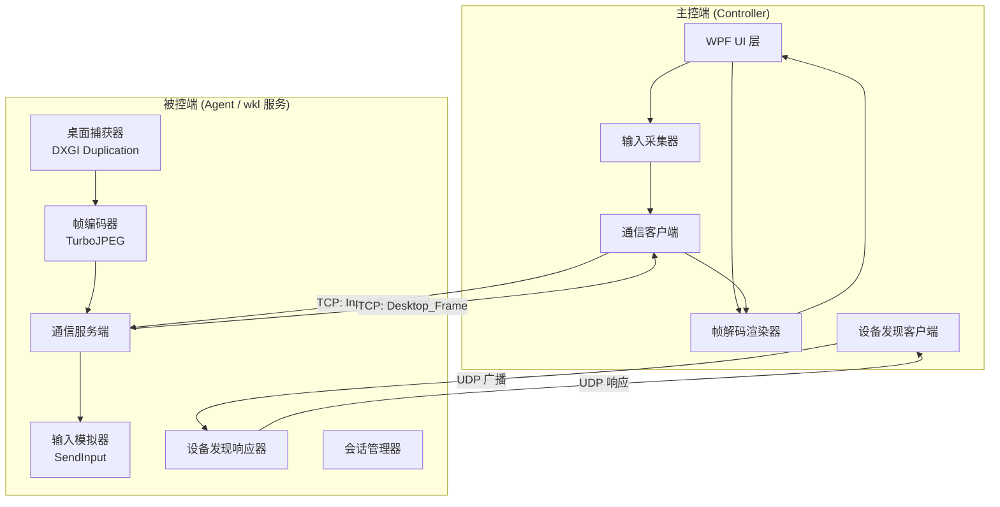
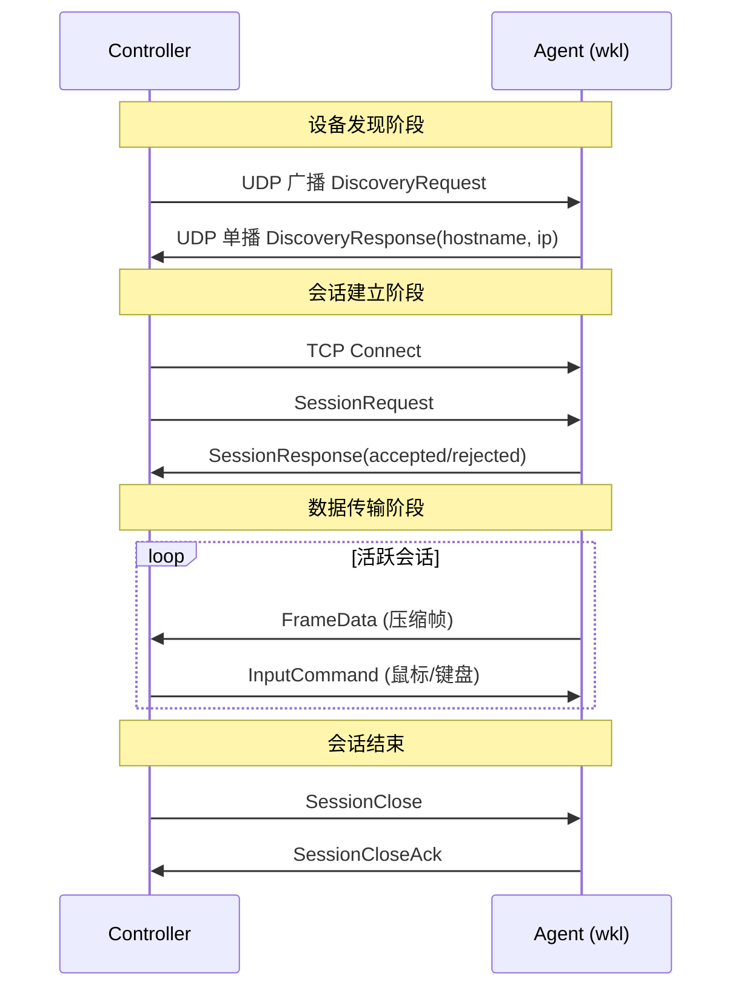

# 技术设计文档：局域网远程控制工具

## 概述

本设计文档描述一个局域网远程控制工具的技术实现方案，包含两个核心组件：

- **被控端（Agent）**：以 Windows 服务形式运行（服务名 "wkl"），负责桌面捕获、输入模拟和网络通信。使用 DXGI Desktop Duplication API 实现高效低开销的桌面捕获，通过 Windows SendInput API 模拟输入操作。
- **主控端（Controller）**：带 GUI 的桌面应用程序，提供实时桌面画面显示、远程输入控制和设备管理功能。

技术栈：.NET 10，目标平台 Windows 10/11 x64。

### 关键设计决策

| 决策 | 选择 | 理由 |
|------|------|------|
| 桌面捕获 | DXGI Desktop Duplication API | GPU 加速，CPU 占用极低（<2%），延迟 <1ms，满足需求 3.9 的 5% 单核限制 |
| 输入模拟 | Windows SendInput API | 系统级输入注入，不触发 UAC，满足需求 4.8 |
| 帧压缩 | Turbojpeg（libjpeg-turbo） | SIMD 加速的 JPEG 编码，1080p 帧压缩 <5ms，压缩比 10:1~20:1 |
| 网络传输 | 原生 TCP Socket + 自定义二进制协议 | 最低延迟，避免 HTTP/gRPC 开销，满足需求 8.6 的 50ms 端到端延迟 |
| 设备发现 | UDP 广播 | 简单可靠的局域网发现机制 |
| UI 框架 | WPF（.NET 10） | 成熟的 Windows 桌面 UI 框架，支持高效图像渲染（WriteableBitmap） |
| 服务框架 | Microsoft.Extensions.Hosting.WindowsServices | .NET 原生 Windows 服务支持 |

## 架构

### 系统架构图



### 通信架构图




## 组件与接口

### 1. 被控端（Agent）组件

#### 1.1 服务宿主（ServiceHost）

负责 Windows 服务生命周期管理。

```csharp
// 使用 .NET Generic Host + WindowsServices 扩展
public class AgentService : BackgroundService
{
    protected override async Task ExecuteAsync(CancellationToken stoppingToken);
}
```

- 服务名称：`wkl`
- 启动类型：自动（Automatic）
- 恢复策略：前 3 次失败在 5 秒内重启，超过 3 次写入事件日志
- 安装/卸载通过命令行参数 `--install` / `--uninstall` 实现，内部调用 `sc.exe` 或 Windows Service API

#### 1.2 桌面捕获器（DesktopCapturer）

使用 DXGI Desktop Duplication API 捕获桌面帧。

```csharp
public interface IDesktopCapturer : IDisposable
{
    /// <summary>捕获下一帧桌面画面</summary>
    /// <param name="timeout">等待超时（毫秒）</param>
    /// <returns>捕获的帧数据，null 表示无变化</returns>
    CapturedFrame? CaptureNextFrame(int timeoutMs = 33);

    /// <summary>当前捕获分辨率</summary>
    Resolution CurrentResolution { get; }

    /// <summary>降低捕获分辨率（资源不足时）</summary>
    void ReduceResolution(float scaleFactor);
}

public readonly record struct CapturedFrame(
    nint DataPointer,      // GPU 纹理指针或内存指针
    int Width,
    int Height,
    int Stride,
    long TimestampTicks
);

public readonly record struct Resolution(int Width, int Height);
```

实现要点：
- 使用 `IDXGIOutputDuplication` 接口获取桌面帧
- 帧数据保持在 GPU 内存中直到编码阶段，减少 CPU-GPU 数据拷贝
- 当帧率低于 20fps 时，按 0.75 倍缩放分辨率（需求 3.6）
- 目标帧率 30fps，帧间隔约 33ms

#### 1.3 帧编码器（FrameEncoder）

将捕获的桌面帧压缩为 JPEG 格式。

```csharp
public interface IFrameEncoder
{
    /// <summary>编码帧数据</summary>
    EncodedFrame Encode(CapturedFrame frame);

    /// <summary>当前压缩质量 (1-100)</summary>
    int Quality { get; set; }
}

public readonly record struct EncodedFrame(
    byte[] Data,
    int Length,
    int Width,
    int Height,
    long TimestampTicks,
    uint SequenceNumber
);
```

实现要点：
- 使用 TurboJpegWrapper（libjpeg-turbo 的 .NET 绑定）
- 默认质量 70，带宽不足时动态降低至 30（需求 8.8）
- 使用对象池（`ArrayPool<byte>`）复用编码缓冲区，减少 GC 压力

#### 1.4 输入模拟器（InputSimulator）

通过 Windows API 模拟鼠标和键盘输入。

```csharp
public interface IInputSimulator
{
    void SimulateMouseMove(int x, int y);
    void SimulateMouseClick(MouseButton button, ClickType clickType);
    void SimulateMouseScroll(int delta);
    void SimulateKeyDown(ushort virtualKeyCode);
    void SimulateKeyUp(ushort virtualKeyCode);
}

public enum MouseButton { Left, Right, Middle }
public enum ClickType { Single, Double }
```

实现要点：
- 使用 `SendInput` Win32 API（P/Invoke）
- 鼠标坐标使用绝对坐标模式（`MOUSEEVENTF_ABSOLUTE`）
- 输入执行在专用高优先级线程上，确保 16ms 内响应（需求 4.1）
- 服务运行在 Session 0，需通过 `CreateProcessAsUser` 或直接使用 `SendInput`（Session 0 下 SendInput 可操作活跃桌面）

#### 1.5 通信服务端（CommunicationServer）

管理 TCP 连接和消息收发。

```csharp
public interface ICommunicationServer : IDisposable
{
    event Action<SessionContext>? OnClientConnected;
    event Action<SessionContext>? OnClientDisconnected;

    Task StartAsync(int port, CancellationToken ct);
    Task StopAsync();
    Task SendFrameAsync(SessionContext session, EncodedFrame frame);
}

public class SessionContext
{
    public string SessionId { get; init; }
    public TcpClient TcpClient { get; init; }
    public NetworkStream Stream { get; init; }
    public bool IsActive { get; set; }
}
```

#### 1.6 设备发现响应器（DiscoveryResponder）

响应 UDP 广播发现请求。

```csharp
public interface IDiscoveryResponder : IDisposable
{
    Task StartAsync(CancellationToken ct);
}
```

- 监听 UDP 端口 19620
- 收到发现请求后回复主机名和 TCP 服务端口

#### 1.7 会话管理器（SessionManager）

管理活跃会话，确保同一时间仅一个会话（需求 7.5）。

```csharp
public interface ISessionManager
{
    SessionContext? ActiveSession { get; }
    bool TryAcceptSession(SessionContext session);
    void EndSession(string sessionId);
}
```

### 2. 主控端（Controller）组件

#### 2.1 WPF 主窗口（MainWindow）

- 设备列表面板：显示发现的 Agent 列表
- 桌面画面显示区域：使用 `WriteableBitmap` 渲染解码后的帧
- 工具栏：连接/断开按钮、手动输入 IP 地址
- 状态栏：连接状态、帧率、延迟信息

#### 2.2 帧解码渲染器（FrameDecoder）

```csharp
public interface IFrameDecoder
{
    /// <summary>解码帧数据为位图</summary>
    DecodedFrame Decode(EncodedFrame encoded);
}

public readonly record struct DecodedFrame(
    byte[] PixelData,
    int Width,
    int Height,
    int Stride
);
```

#### 2.3 输入采集器（InputCollector）

捕获用户在桌面画面显示区域的鼠标和键盘操作，转换为 `InputCommand` 发送。

```csharp
public interface IInputCollector
{
    event Action<InputCommand>? OnInputCaptured;
    void Attach(UIElement target);
    void Detach();
}
```

- 鼠标移动事件采集频率不低于 60Hz（需求 4.5）
- 坐标映射：将 UI 控件坐标转换为被控端桌面坐标

#### 2.4 通信客户端（CommunicationClient）

```csharp
public interface ICommunicationClient : IDisposable
{
    event Action<EncodedFrame>? OnFrameReceived;
    event Action? OnDisconnected;

    Task ConnectAsync(string host, int port, CancellationToken ct);
    Task DisconnectAsync();
    Task SendInputCommandAsync(InputCommand command);
    bool IsConnected { get; }
}
```

#### 2.5 设备发现客户端（DiscoveryClient）

```csharp
public interface IDiscoveryClient
{
    Task<List<DiscoveredAgent>> ScanAsync(TimeSpan timeout, CancellationToken ct);
}

public record DiscoveredAgent(string HostName, string IpAddress, int Port);
```


## 数据模型

### 网络协议消息格式

所有消息使用自定义二进制协议，格式如下：

```
+----------------+----------------+------------------+
| MessageType    | PayloadLength  | Payload          |
| (1 byte)       | (4 bytes, LE)  | (variable)       |
+----------------+----------------+------------------+
```

### 消息类型枚举

```csharp
public enum MessageType : byte
{
    // 设备发现（UDP）
    DiscoveryRequest  = 0x01,
    DiscoveryResponse = 0x02,

    // 会话管理（TCP）
    SessionRequest    = 0x10,
    SessionResponse   = 0x11,
    SessionClose      = 0x12,
    SessionCloseAck   = 0x13,
    Heartbeat         = 0x14,

    // 数据传输（TCP）
    FrameData         = 0x20,
    InputCommand      = 0x30,
}
```

### 核心数据结构

```csharp
/// <summary>设备发现响应</summary>
public record DiscoveryResponsePayload(
    string HostName,
    int TcpPort
);

/// <summary>会话请求</summary>
public record SessionRequestPayload(
    string ControllerName,
    int ProtocolVersion
);

/// <summary>会话响应</summary>
public record SessionResponsePayload(
    bool Accepted,
    string? RejectReason,
    int DesktopWidth,
    int DesktopHeight
);

/// <summary>帧数据头</summary>
public readonly record struct FrameHeader(
    uint SequenceNumber,
    int Width,
    int Height,
    int CompressedLength,
    long TimestampTicks
);

/// <summary>输入指令</summary>
public record InputCommand
{
    public InputType Type { get; init; }
    public int X { get; init; }          // 鼠标 X 坐标
    public int Y { get; init; }          // 鼠标 Y 坐标
    public MouseButton Button { get; init; }
    public ClickType ClickType { get; init; }
    public int ScrollDelta { get; init; }
    public ushort VirtualKeyCode { get; init; }
    public bool IsKeyDown { get; init; }
}

public enum InputType : byte
{
    MouseMove   = 0x01,
    MouseClick  = 0x02,
    MouseScroll = 0x03,
    KeyPress    = 0x04,
}
```

### 帧数据传输格式

帧数据在 TCP 流中的布局：

```
+----------------+----------------+------------------+-----------+
| MessageType    | PayloadLength  | FrameHeader      | JPEG Data |
| 0x20 (1 byte)  | (4 bytes, LE)  | (25 bytes)       | (variable)|
+----------------+----------------+------------------+-----------+
```

FrameHeader 二进制布局（25 字节）：

```
+------------------+--------+--------+------------------+------------------+
| SequenceNumber   | Width  | Height | CompressedLength | TimestampTicks   |
| (4 bytes, LE)    | (4B)   | (4B)   | (4 bytes, LE)    | (8 bytes, LE)    |
+------------------+--------+--------+------------------+------------------+
```

### 序列化

会话管理消息（SessionRequest、SessionResponse 等）的 Payload 使用 `System.Text.Json` 进行 UTF-8 JSON 序列化。帧数据和输入指令使用上述固定布局的二进制序列化，通过 `BinaryPrimitives` 读写，避免额外分配。


## 正确性属性（Correctness Properties）

*属性（Property）是指在系统所有有效执行中都应成立的特征或行为——本质上是对系统应做什么的形式化陈述。属性是人类可读规格说明与机器可验证正确性保证之间的桥梁。*

### Property 1: 进程名称不含敏感关键词

*For any* Agent 可执行文件名和服务名称，其中不应包含 "remote"、"control"、"spy"、"monitor"、"capture"、"keylog" 等敏感关键词（不区分大小写）。

**Validates: Requirements 1.6**

### Property 2: 连续崩溃超阈值触发日志记录

*For any* 崩溃计数值 N（N > 3），崩溃记录器应生成一条包含崩溃次数和时间戳的事件日志条目；对于 N ≤ 3，不应生成日志条目。

**Validates: Requirements 2.2**

### Property 3: 低帧率触发自适应分辨率降低

*For any* 帧率采样值，当帧率低于 20fps 时，自适应控制器应输出一个小于 1.0 的缩放因子；当帧率 ≥ 20fps 时，不应触发分辨率调整。

**Validates: Requirements 3.6**

### Property 4: 输入指令到 SendInput 结构转换正确性

*For any* 有效的 InputCommand（包括鼠标移动、点击、滚轮、键盘按下/释放），输入模拟器应生成与之对应的正确 SendInput 结构体：鼠标指令应映射到正确的坐标和按钮标志，键盘指令应映射到正确的虚拟键码和按键状态。

**Validates: Requirements 4.1, 4.2**

### Property 5: 输入指令执行顺序保持

*For any* InputCommand 序列，输入模拟器的执行顺序应与接收顺序完全一致——即输出序列的顺序应与输入序列的顺序相同。

**Validates: Requirements 4.4**

### Property 6: UI 事件到 InputCommand 转换正确性

*For any* 在桌面画面显示区域产生的鼠标事件（移动、点击、滚轮）或键盘事件（按下、释放），输入采集器应生成包含正确类型、坐标（经过坐标映射）和键码的 InputCommand。

**Validates: Requirements 5.3**

### Property 7: 设备发现请求-响应正确性

*For any* 有效的 DiscoveryRequest UDP 数据包，设备发现响应器应返回一个包含非空主机名和有效 TCP 端口号（1-65535）的 DiscoveryResponse。

**Validates: Requirements 6.1**

### Property 8: 发现结果显示完整性

*For any* DiscoveredAgent 列表，UI 渲染后的设备列表应包含每个 Agent 的主机名和 IP 地址，且列表项数量与输入列表一致。

**Validates: Requirements 6.3**

### Property 9: IP 地址格式验证

*For any* 字符串输入，IP 地址验证器应仅接受有效的 IPv4 地址格式（四组 0-255 的数字，以点分隔）；对于任何不符合格式的字符串，应返回验证失败。

**Validates: Requirements 6.4**

### Property 10: 单活跃会话约束

*For any* 数量 N（N ≥ 2）的并发会话请求，会话管理器应仅接受其中 1 个，拒绝其余 N-1 个。当已有活跃会话时，任何新的会话请求都应被拒绝。

**Validates: Requirements 7.5**

### Property 11: 帧压缩有效性

*For any* 有效的原始桌面帧数据（宽度 > 0，高度 > 0），编码后的数据大小应严格小于原始帧数据大小。

**Validates: Requirements 8.3**

### Property 12: 帧编解码往返一致性

*For any* 有效的原始桌面帧，经过编码（JPEG 压缩）再解码后，得到的图像应与原始帧视觉等价——即两幅图像的 PSNR（峰值信噪比）应不低于 30dB，且尺寸（宽度、高度）完全一致。

**Validates: Requirements 8.5**

### Property 13: 低带宽触发自适应压缩质量调整

*For any* 网络带宽测量值，当带宽低于预设阈值时，自适应控制器应降低编码器的 JPEG 质量参数；当带宽恢复到阈值以上时，质量参数应恢复到默认值。

**Validates: Requirements 8.8**

### Property 14: 日志条目不含敏感关键词

*For any* Agent 写入 Windows 事件日志的条目，其消息内容不应包含 "remote control"、"desktop capture"、"screen spy"、"input simulation" 等可能引起注意的敏感短语。

**Validates: Requirements 9.5**


## 错误处理

### 被控端（Agent）错误处理

| 错误场景 | 处理策略 |
|----------|----------|
| DXGI Desktop Duplication 初始化失败 | 记录错误日志，等待 1 秒后重试，最多重试 5 次；若仍失败则拒绝新会话请求 |
| 桌面捕获帧获取超时 | 跳过当前帧，继续下一帧捕获；连续超时 10 次则重新初始化 DXGI 资源 |
| JPEG 编码失败 | 跳过当前帧，记录警告日志；连续失败 5 次则降低分辨率重试 |
| SendInput 调用失败 | 记录警告日志，丢弃当前输入指令，继续处理后续指令 |
| TCP 连接异常断开 | 清理会话资源，恢复到等待连接状态 |
| 内存不足（OutOfMemoryException） | 释放帧缓冲区，强制 GC，降低捕获分辨率和编码质量 |
| 服务崩溃 | 由 Windows SCM 自动重启（前 3 次 5 秒内重启），超过 3 次写入事件日志 |

### 主控端（Controller）错误处理

| 错误场景 | 处理策略 |
|----------|----------|
| TCP 连接失败 | 在 UI 显示连接失败提示，允许用户重试 |
| 会话被 Agent 拒绝 | 在 UI 显示 "被控端已有活跃连接" 提示 |
| 帧解码失败 | 跳过损坏帧，保持显示上一个有效帧 |
| 网络连接中断 | 在 UI 显示断开提示，自动清理会话资源 |
| UDP 发现超时 | 在 UI 显示 "未发现设备" 提示，允许用户重新扫描或手动输入 IP |
| 无效 IP 地址输入 | 在输入框旁显示格式错误提示，阻止连接操作 |

### 资源管理

- 所有网络连接（TcpClient、UdpClient、NetworkStream）使用 `IDisposable` 模式管理
- 帧数据缓冲区使用 `ArrayPool<byte>.Shared` 租借和归还，避免大对象堆分配
- DXGI 资源（IDXGIOutputDuplication、ID3D11Texture2D）在会话结束或错误恢复时显式释放
- 使用 `CancellationToken` 在服务停止时优雅终止所有异步操作

## 测试策略

### 测试方法概述

采用双轨测试策略：

- **单元测试**：验证具体示例、边界条件和错误处理逻辑
- **属性测试（Property-Based Testing）**：验证跨所有输入的通用属性

两者互补：单元测试捕获具体 bug，属性测试验证通用正确性。

### 属性测试框架

- **框架选择**：[FsCheck](https://fscheck.github.io/FsCheck/)（.NET 生态最成熟的属性测试库）
- **配置**：每个属性测试最少运行 100 次迭代
- **标签格式**：每个测试用注释标注对应的设计属性
  - 格式：`// Feature: lan-remote-control, Property {number}: {property_text}`

### 属性测试计划

每个正确性属性对应一个属性测试：

| 属性编号 | 测试描述 | 生成器 |
|----------|----------|--------|
| Property 1 | 进程名称不含敏感关键词 | 生成随机字符串，验证敏感词检测函数 |
| Property 2 | 崩溃计数触发日志 | 生成随机崩溃计数（0-100），验证日志触发逻辑 |
| Property 3 | 低帧率触发分辨率降低 | 生成随机帧率值（0-60），验证自适应控制器输出 |
| Property 4 | InputCommand 到 SendInput 转换 | 生成随机 InputCommand（各类型），验证 SendInput 结构正确性 |
| Property 5 | 输入指令顺序保持 | 生成随机 InputCommand 序列，验证执行顺序一致 |
| Property 6 | UI 事件到 InputCommand 转换 | 生成随机鼠标/键盘事件和视口尺寸，验证坐标映射和类型转换 |
| Property 7 | 设备发现请求-响应 | 生成随机主机名和端口配置，验证响应格式 |
| Property 8 | 发现结果显示完整性 | 生成随机 DiscoveredAgent 列表，验证渲染输出 |
| Property 9 | IP 地址验证 | 生成随机字符串（含有效和无效 IP），验证验证器行为 |
| Property 10 | 单活跃会话约束 | 生成随机数量的并发请求，验证仅一个被接受 |
| Property 11 | 帧压缩有效性 | 生成随机像素数据帧，验证编码后尺寸更小 |
| Property 12 | 帧编解码往返一致性 | 生成随机像素数据帧，验证编码-解码后 PSNR ≥ 30dB |
| Property 13 | 低带宽触发质量调整 | 生成随机带宽值，验证质量参数调整逻辑 |
| Property 14 | 日志条目不含敏感词 | 生成随机日志消息，验证敏感词过滤 |

### 单元测试计划

| 测试范围 | 测试内容 |
|----------|----------|
| 服务安装/卸载 | 验证 `--install` 和 `--uninstall` 命令行参数解析正确 |
| 服务恢复配置 | 验证 SCM 恢复策略配置为 5 秒重启 |
| 崩溃恢复后就绪 | 验证服务初始化后进入可接受连接状态 |
| 会话建立 | 验证 SessionRequest/SessionResponse 握手流程 |
| 会话断开 | 验证主动断开和被动断开的资源清理 |
| 网络断开提示 | 验证连接中断时 UI 显示正确提示 |
| 帧解码失败回退 | 验证损坏帧被跳过，保持显示上一有效帧 |
| 消息序列化/反序列化 | 验证各消息类型的二进制序列化正确性 |
| 连接/断开按钮 | 验证 UI 按钮触发正确的连接/断开操作 |
| 窗口关闭清理 | 验证关闭窗口时断开会话并释放资源 |

### 集成测试

- 使用 mock 的 DXGI 接口测试完整的捕获-编码-传输-解码-渲染管线
- 使用 loopback TCP 连接测试完整的会话生命周期
- 使用 loopback UDP 测试设备发现流程

